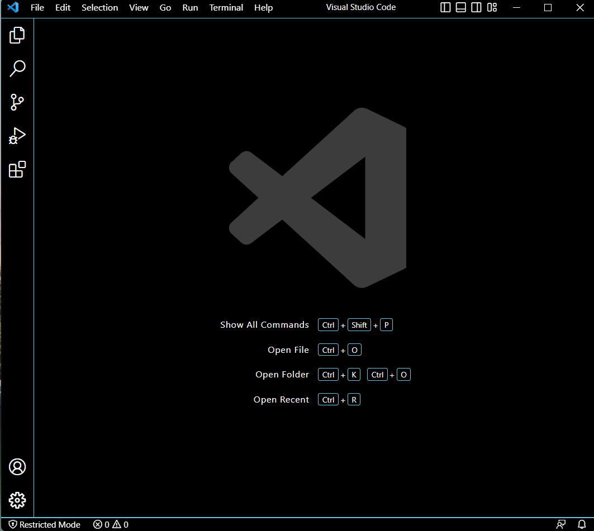
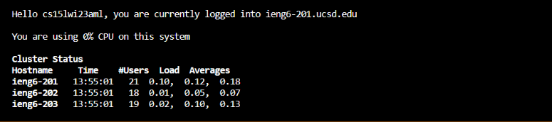
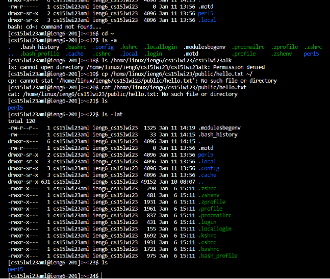

***Step 1: Installing VScode***
---
I didn't have to install VScode, as I already had it installed from when I took CSE 11. 
However in order to install VScode, head over to [https://code.visualstudio.com/](https://code.visualstudio.com/), and follow the installation instructions for your respective operating system if that may be Windows or Mac.
After installing Vscode however, you should be able to open and launch a window similar to the image below.

***Step 2: Remotely Connecting***
---
1. In order to remotely connect to an online server, you must first install Git for Windows. 
2. After the installation is complete, open VScode and open the search bar by holding ***ctrl*** + ***shift*** + ***p***.
3. Type ***Select Default Profile***.
4. Select ***Git Bash***.
5. Next, open a terminal by clicking on the terminal tab at the top of your screen and select ***New Terminal***.
6. Type `ssh` ***cs15lwi23zz@ieng6.ucsd.edu***, where zz are the letters of your course account.
7. In order to find the letters of course account, go to [https://sdacs.ucsd.edu/~icc/index.php](https://sdacs.ucsd.edu/~icc/index.php) and follow the instructions there to lookup your account and reset your password.
8. Type `yes` and enter the password that you created to login into your account. 
You should now see the image below.

***Step 3: Trying Some Commands***
---
1. I tested some commands after on the remote connected terminal such as:

- `cd` 
- `ls` 
- `pwd` 
- `mkdir`
- `cp` 
- `cd~`
- `ls -lat`
- `ls -a` 
- `ls <directory>, where <directory> is /home/linux/ieng6/cs15lwi23abc, where abc is one of the other group members'username`
- `cp /home/linux/ieng6/cs15lwi23/public/hello.txt ~/` 
- `cat /home/linux/ieng6/cs15lwi23/public/hello.txt`
  
It should look something like the image below.
  
 

2. I learned a bit about the processing and command power that remote servers have that our terminals normally don't have. For example, with `cd`, I am able to look into specific directories and with `ls`, I am able to see a list of files within that directory in order to see if the file I am looking for is there. There are also some unique commands such as `scp`, which is the secure copy command and it grants us the ability to copy files from one computer to another. All of these commands are valuable for us as we learn more on how to properly use remote servers so that one day, we can create our own remote servers for specified purposes and functions.
